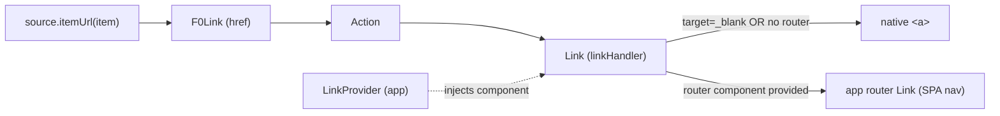
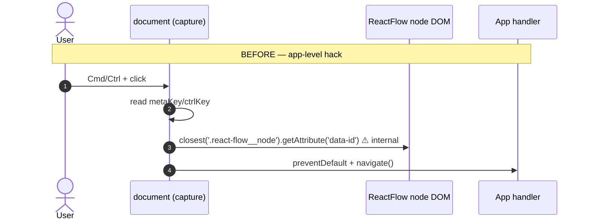

# RFC — Wire `itemUrl` to graph nodes for Cmd/Ctrl+click navigation

> **Status:** Draft / design declaration. This PR intentionally ships **no runtime code** yet.
> Its purpose is to document a large-scope change end-to-end, layer by layer, and lock the
> design (and one product decision) before implementation lands in follow-up PRs.

## Description

Graph nodes cannot be opened in a new tab the way table/list/card rows can. `OneDataCollection`
already exposes `source.itemUrl`, and every other visualization renders it as a real link so the
browser handles `Cmd`/`Ctrl`/middle‑click natively. The **Graph** visualization never wires
`itemUrl` — so a consumer who wanted `Cmd`/`Ctrl+click` to navigate had to reach around the public
API and listen for native clicks on `document`, scraping ReactFlow's internal DOM
(`.react-flow__node` + `data-id`). This RFC declares the objective of **homogenizing Graph with the
other visualizations by wiring `itemUrl` through a real `F0Link`**, which removes the fragile
ReactFlow DOM dependency from the navigation path entirely.

## Objective

- **Wire `source.itemUrl` to graph nodes** so that `Cmd`/`Ctrl`/middle‑click opens the node's URL in
  a new tab **natively** (browser‑driven, zero key‑reading JS, zero ReactFlow DOM scraping).
- **Homogenize** Graph with Table / List / Card, which all already route `itemUrl` →
  `F0Link` → `Action` → router `Link`.
- **Preserve** the current graph UX: a plain left‑click still opens the drawer (see
  [Product decision](#product-decision-plain-click)).
- **Isolate** the one remaining internal ReactFlow dependency (used only for pan‑vs‑click) to a
  single, commented location — addressing the original review concern.

## Non‑goals

- A general "keybinding map" API for arbitrary modifier→behavior bindings. A single, well‑placed
  `href` covers the concrete need; a declarative binding layer can be built on top later if demand
  appears. See [Alternatives considered](#alternatives-considered).
- Rewriting F0Graph's selection / roving‑tabindex model.
- Removing the internal pan‑vs‑click pointer handler (it still needs the DOM node id); we only
  document and centralize it.

## Implementation details

Planned changes (this PR ships **only this document**; the bullets below are the roadmap the
follow-up PRs will implement):

- feat(F0Graph): add `href` / `linkLabel` / `linkTarget` to `F0GraphNode`, rendering an `F0Link`
  overlay so Cmd/Ctrl/middle-click opens the node URL natively
- refactor(F0Graph): widen node `onClick` to `(e?: React.MouseEvent) => void` on both
  `F0GraphNodeProps` and `F0GraphNodeRenderContext` (additive, backward-compatible)
- feat(OneDataCollection): wire `source.itemUrl` in the Graph visualization, preserving the drawer
  on plain click and delegating modified clicks to the native anchor
- chore(F0Graph): centralize + comment the internal ReactFlow selectors
  (`RF_NODE_SELECTOR` / `RF_NODE_ID_ATTR`) and add a canary test guarding the DOM shape
- test(F0Graph): unit + interaction + a11y coverage for the link overlay and click disambiguation

See the layered design below for the full rationale, diagrams, and the confirmed product decision.

---

## Layer 0 — TL;DR

```
BEFORE (in the consuming app)          AFTER (homogenized in F0)
─────────────────────────────         ─────────────────────────────
document.addEventListener(             <F0GraphNode href={itemUrl} …>
  'click', handler, /*capture*/ true)     └─ renders a real <a> (F0Link)
  └─ if (metaKey||ctrlKey)                    └─ Cmd/Ctrl/middle-click →
  └─ target.closest('.react-flow__node')         browser opens a new tab
  └─ .getAttribute('data-id')                    (native, no JS keys)
  └─ navigate(...)                          └─ plain click → drawer
  ⚠ depends on ReactFlow internals         ✓ no ReactFlow internals on this path
  ⚠ breaks silently on upgrade             ✓ same stack as Table/List/Card
```

---

## Layer 1 — The symptom (review concern)

A code review flagged the consuming app's organigram view:

> **Relies on ReactFlow internal DOM structure.** This reads `.react-flow__node` (CSS class) and
> `data-id` (attribute) directly from the DOM. Both are ReactFlow implementation details, not part
> of its public API. A ReactFlow upgrade that renames either would silently break `Cmd`/`Ctrl+click`
> with no error and no test to catch it.

The app's workaround listened at `document` level in the capture phase:

```tsx
// consuming app — index.tsx (~line 540)
useEffect(() => {
  const handleModifiedClick = (event: MouseEvent) => {
    if (!event.metaKey && !event.ctrlKey) return // 1. modifier?
    if (!(event.target instanceof Element)) return
    const teamId = event.target
      .closest(".react-flow__node") // 2. climb to node  ⚠ internal
      ?.getAttribute("data-id") // 3. read the id    ⚠ internal
    if (!teamId) return
    event.preventDefault()
    event.stopPropagation() // 4. cut ReactFlow off
    navigate(navigation.employees.teams.id.fullPath({ id: teamId }))
  }
  document.addEventListener("click", handleModifiedClick, true) // capture phase
  return () => document.removeEventListener("click", handleModifiedClick, true)
}, [navigate, navigation])
```

The concern is correct: `.react-flow__node` and `data-id` are **not** ReactFlow's public API.

---

## Layer 2 — What's actually underneath

F0Graph renders each node through the ReactFlow library. ReactFlow paints one `<div>` per node:

```html
<!-- what ReactFlow emits per node -->
<div class="react-flow__node" data-id="42">
  <!-- avatar, name, tags for team 42 -->
</div>
```

`data-id="42"` is the node id — the exact hook the app scraped. **Importantly, F0Graph already
depends on this same internal shape itself** to distinguish a node click from a pan‑drag:

```tsx
// packages/react/src/patterns/F0Graph/components/F0GraphView/F0GraphView.tsx (~L464–479)
onPointerUp={(e) => {
  const start = pointerDownRef.current
  pointerDownRef.current = null
  if (!start || start.id !== e.pointerId) return
  const dx = e.clientX - start.x
  const dy = e.clientY - start.y
  if (dx * dx + dy * dy > NODE_CLICK_DISTANCE_SQ) return  // it was a pan, not a click
  const target = e.target as HTMLElement | null
  const nodeEl = target?.closest<HTMLElement>(".react-flow__node")  // ⚠ internal
  if (!nodeEl) return
  const id = nodeEl.getAttribute("data-id")                          // ⚠ internal
  if (id) selectNode(id)
}}
```

So the fragile dependency the review flags **already lives inside F0Graph** — in exactly one place.
That is good news: we do not need to spread it further, and we can centralize + document it.

---

## Layer 3 — Root cause: Graph never wires `itemUrl`

`OneDataCollection` sources expose **two** interaction hooks:

```ts
// packages/react/src/patterns/OneDataCollection/hooks/useDataCollectionSource/types.ts
itemUrl?: (item: R) => string          // → rendered as a real <a href>
itemOnClick?: (item: R) => () => void  // → imperative handler (e.g. open a drawer)
```

Every visualization **except Graph** renders `itemUrl` as a link:

| Visualization | Wires `itemUrl`? | How                                                                    |
| ------------- | ---------------- | ---------------------------------------------------------------------- |
| Table         | ✅               | `TableCell href={itemHref}` (`Table/components/Row.tsx:316`)           |
| List          | ✅               | `<F0Link href={itemHref}>` overlay (`List/components/Row.tsx:127‑137`) |
| Card          | ✅               | `link={itemHref}` (`Card/index.tsx:305`)                               |
| **Graph**     | ❌               | only `source.itemOnClick` is wired (`Graph/index.tsx:208`)             |

```tsx
// packages/react/src/patterns/OneDataCollection/visualizations/collection/Graph/index.tsx (today)
renderNode={(node, ctx) => {
  const itemOnClick = source.itemOnClick?.(node.data)   // ← only this
  return (
    <F0GraphNode
      {...ctx}
      onClick={() => { ctx.onClick(); itemOnClick?.() }}  // no href → no native nav
    />
  )
}}
```

Because Graph never emits a real anchor, the browser can't do native `Cmd`/`Ctrl+click`, and the
public `onClick` is a bare `() => void` that drops the event — so a consumer has no way to read
modifier keys. That gap is what forced the `document`-level hack.

---

## Layer 4 — The link infrastructure that already exists

The other visualizations lean on a shared, router‑aware link stack. Nothing new needs inventing:



Key property (`packages/react/src/lib/linkHandler.tsx:145`): the router `Link` renders a **real
`<a>`**, and for `target="_blank"` (or when no router component is registered) it always uses the
native anchor. Standard router `Link` components ignore modified clicks by design and let the
browser open a new tab. So:

- **Plain click** → SPA client‑side navigation (via `LinkProvider`).
- **Cmd/Ctrl/middle‑click** → **native** browser new tab. No JS reads any key.

List already uses this as an absolute overlay — the pattern we will mirror in the node:

```tsx
// packages/react/src/patterns/OneDataCollection/visualizations/collection/List/components/Row.tsx:127-137
{
  itemHref && (
    <F0Link
      href={itemHref}
      className="pointer-events-auto absolute inset-0 block"
      tabIndex={0}
      onClick={itemOnClick}
    >
      <span className="sr-only">{actions.view}</span>
    </F0Link>
  )
}
```

---

## Layer 5 — Proposal: wire `itemUrl` via a node‑level `F0Link` overlay

### 5.1 Flow comparison



```mermaid
sequenceDiagram
  autonumber
  actor U as User
  participant A as F0Link &lt;a href&gt; (node overlay)
  participant B as Browser
  participant G as Graph view onClick
  Note over U,G: AFTER — native anchor
  U->>A: Cmd/Ctrl/middle + click
  A->>B: default anchor behavior
  B-->>U: opens href in a new tab (native, no JS keys)
  Note over U,G: plain click
  U->>A: left click (no modifier)
  A->>G: onClick(event)
  G->>G: event.preventDefault() (block nav)
  G->>G: ctx.onClick() + itemOnClick()  → drawer
```

### 5.2 DOM layering inside the node

```
┌─ role="treeitem" (F0GraphNode) ── roving tabindex, Enter/Space, arrows ─┐
│  ┌─ pill ────────────────────────────────────────────────────────────┐ │
│  │  avatar   title / subtitle                         [node actions]   │ │  ← actions: z above overlay
│  │                                                                     │ │
│  │  ░░░░░ F0Link overlay (absolute inset-0, tabIndex=-1, aria-hidden) ░│ │  ← native modifier-click target
│  └─────────────────────────────────────────────────────────────────── ┘ │
│  [ tags row ]                          (overlay does NOT cover this)      │
└──────────────────────────────────────────────────────────────────────────┘
        ▲ expander/collapser live OUTSIDE the node — overlay never covers them
```

The overlay is a **mouse affordance** for native modifier‑click. Keyboard activation stays on the
`treeitem` (Enter → drawer), so the overlay is `tabIndex={-1}` / `aria-hidden` to avoid a second tab
stop and keep the roving‑tabindex model intact.

---

## Product decision — plain click

When a source provides **both** `itemOnClick` (drawer) and `itemUrl` (page), the plain (unmodified)
click must be disambiguated. Table/List navigate on plain click; the organigram opens a drawer.

**Decision (confirmed): preserve the drawer on plain click.**

| Click                    | Only `itemUrl`              | `itemUrl` + `itemOnClick` (drawer) |
| ------------------------ | --------------------------- | ---------------------------------- |
| Plain left‑click         | navigate (like a table row) | **open drawer** (nav suppressed)   |
| Cmd/Ctrl/middle‑click    | native new tab              | native new tab                     |
| Enter / Space (keyboard) | activate (drawer/onClick)   | activate (drawer/onClick)          |

> Note: reading `event.metaKey` on the node's own React `MouseEvent` to suppress navigation on a
> plain click is **stable public API** — it is _not_ the fragile part. The fragile part was the
> `document`-level capture + `.react-flow__node`/`data-id` scraping, which this design deletes.

---

## Layer 6 — API changes

### 6.1 `F0GraphNode` gains `href` (mirrors how `TableCell` accepts `href`)

```ts
// packages/react/src/patterns/F0Graph/components/F0GraphNode/types.ts
export interface F0GraphNodeProps {
  // …existing…
  /**
   * When set, an F0Link overlay wraps the node's pill. Native Cmd/Ctrl/middle-click
   * opens it in a new tab; plain click remains overridable via `onClick`.
   */
  href?: string
  /** sr-only label for the link overlay (e.g. "View team"). */
  linkLabel?: string
  /** Anchor target. Defaults to "_self" (SPA nav on plain click). */
  linkTarget?: "_self" | "_blank"

  /** CHANGED: now receives the event so consumers can branch on modifiers / preventDefault. */
  onClick?: (e?: React.MouseEvent) => void // was: () => void
}
```

`onClick` widening from `() => void` to `(e?: React.MouseEvent) => void` is **additive and
backward‑compatible** — existing `ctx.onClick()` call sites keep compiling.

### 6.2 `F0GraphNodeRenderContext.onClick` widens the same way

```ts
// packages/react/src/patterns/F0Graph/F0Graph.tsx
export interface F0GraphNodeRenderContext {
  // …existing…
  onClick: (e?: React.MouseEvent) => void // was: () => void
}
```

### 6.3 Graph visualization wires `source.itemUrl`

```tsx
// packages/react/src/patterns/OneDataCollection/visualizations/collection/Graph/index.tsx
renderNode={(node, ctx) => {
  const url = source.itemUrl?.(node.data)
  const itemOnClick = source.itemOnClick?.(node.data)
  return (
    <F0GraphNode
      {...ctx}
      href={url}
      linkLabel={/* i18n "view" */}
      onClick={(e) => {
        // Modifier / middle click → let the anchor do native new-tab.
        if (url && itemOnClick && (e?.metaKey || e?.ctrlKey || e?.shiftKey)) return
        // Plain click with a drawer → suppress navigation, open the drawer.
        if (url && itemOnClick) e?.preventDefault()
        ctx.onClick()
        itemOnClick?.()
      }}
      /* …avatar, title, subtitle, tags, actions… */
    />
  )
}}
```

### 6.4 Consuming app deletes the hack

```tsx
// consuming app — remove the entire document-level useEffect, then:
<DataCollection
  source={{
    // …
    itemUrl: (team) => navigation.employees.teams.id.fullPath({ id: team.id }),
  }}
/>
```

---

## Layer 7 — Isolating the remaining ReactFlow dependency

The navigation path no longer touches ReactFlow internals. The **only** remaining internal use is
the pan‑vs‑click pointer handler in `F0GraphView`. We centralize and document it (the review's
minimal ask):

```ts
// packages/react/src/patterns/F0Graph/constants.ts
/**
 * ⚠️ INTERNAL ReactFlow detail (NOT public API): the per-node class and id attribute.
 * Used only to resolve a clicked node id for the pan-vs-click pointer handler.
 * A ReactFlow upgrade that renames either will break node-click resolution SILENTLY.
 * → Re-check this when bumping @xyflow/react.
 */
export const RF_NODE_SELECTOR = ".react-flow__node"
export const RF_NODE_ID_ATTR = "data-id"
```

Plus a **canary test** that renders the graph and asserts `.react-flow__node[data-id]` exists — it
doesn't test our logic, but it rings the alarm if a ReactFlow upgrade changes the DOM shape.

---

## Layer 8 — Accessibility & edge cases to validate during implementation

- **Anchor inside `role="treeitem"`** — overlay is `tabIndex={-1}` + `aria-hidden`; semantic
  activation stays on the treeitem (Enter/Space). No double tab stop; roving tabindex untouched.
- **`pointer-events` layering** — overlay covers the pill only, and must sit **below** node actions
  and the expander/collapser so their clicks still register.
- **Pan‑vs‑click** — the browser does not fire `click` after a real drag, so the anchor won't
  navigate at the end of a pan; verify against the existing `NODE_CLICK_DISTANCE_SQ` logic.
- **Middle‑click / "copy link address"** — now supported for free (real anchor); previously
  impossible with the JS hack.

---

## Layer 9 — Phased delivery

| Phase | Scope                                                                       | Repo     | Risk           |
| ----- | --------------------------------------------------------------------------- | -------- | -------------- |
| 1     | `F0GraphNode.href` + `F0Link` overlay + widen `onClick(e?)` + stories/tests | `f0`     | Low (additive) |
| 2     | Wire `source.itemUrl` in the Graph visualization                            | `f0`     | Low            |
| 3     | Centralize + comment `RF_NODE_SELECTOR`/`RF_NODE_ID_ATTR` + canary test     | `f0`     | Very low       |
| 4     | App: delete the `document` hack, add `itemUrl` to the source                | app repo | Low            |

---

## Layer 10 — Testing plan

- **Unit (F0GraphNode):** renders an `<a href>` overlay when `href` is set; omits it otherwise;
  overlay is not a tab stop; plain click calls `onClick` with the event.
- **Interaction (Graph view):** plain click opens the drawer and suppresses navigation; modified
  click does **not** call `preventDefault` (native new‑tab path); only `itemUrl` → plain click
  navigates.
- **Canary:** `.react-flow__node[data-id]` exists after render (ReactFlow upgrade guard).
- **A11y:** axe pass on a node with `href`; keyboard activation still opens the drawer.

---

## Alternatives considered

1. **`onNodeClick(nodeId, node, meta)` callback with a modifier descriptor.** Flexible (arbitrary
   modifier→behavior bindings) but re‑implements navigation in JS and does not homogenize with the
   other visualizations. Kept as a possible future layer, not the primary solution.
2. **Declarative keybinding map** (`{ "cmd+click": fn, … }`). More surface area than the concrete
   need warrants; can be built on top of (1) later.
3. **Keep the `document` hack but centralize the selector.** Addresses the review literally but
   leaves Graph inconsistent with Table/List/Card and keeps a fragile path. Rejected.

The chosen approach (`itemUrl` → `F0Link` overlay) is the smallest change that removes the fragile
dependency from the navigation path **and** makes Graph consistent with the rest of the collection.
